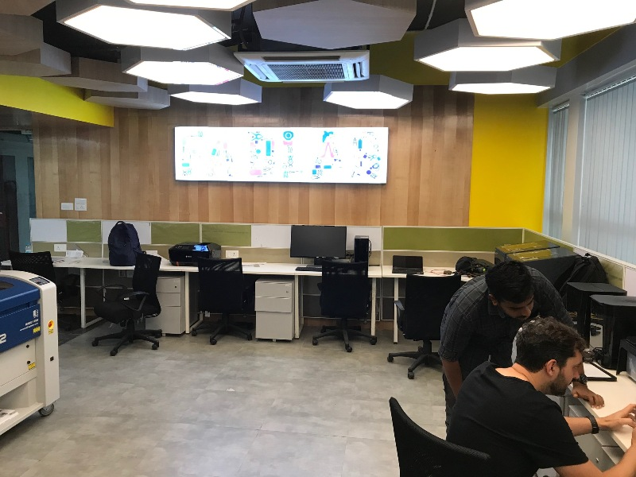

# chintu
I am working in STPI,Bhubaneswar.
I joined FAB Lab Training on 18th Mar 2019.
First day they taught us about Github and we all opened a account on Github.
On the second day they taught us about Git and Visual Studio Code software and we installed it in our Laptop.
Open a account on github.com.
Create a repository.
Install Git Lense and Code Spell Checker in the extension.
Ctrl+Shift+p and type >git: clone and press enter.
Copy the repository URL from the github account and paste it then enter.
Save it by pressing ctrl+s.
Give commit message and commit it.
Push to the message to the Website and check it in your github account.
Rules: Always use small letters for naming the files.
Image size should be in 800X600.
<Fab Lab Images of STPI, Bhubaneswar>

