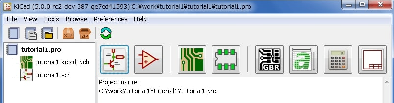
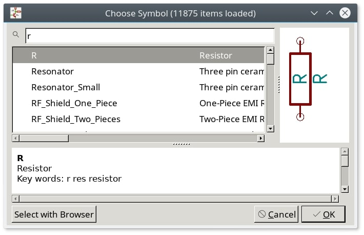
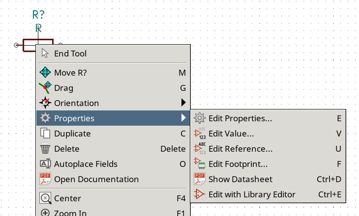
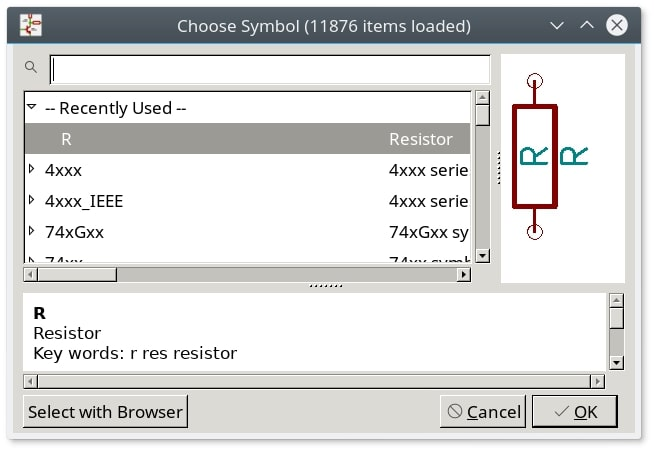
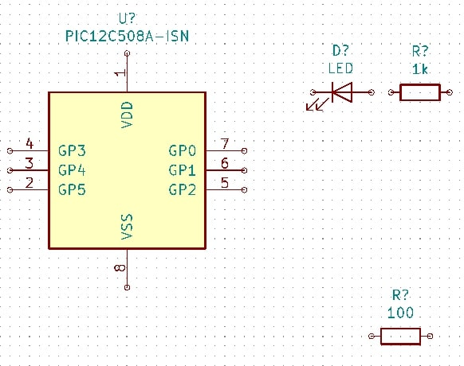
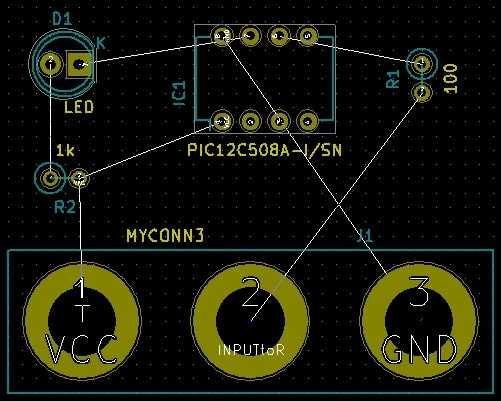
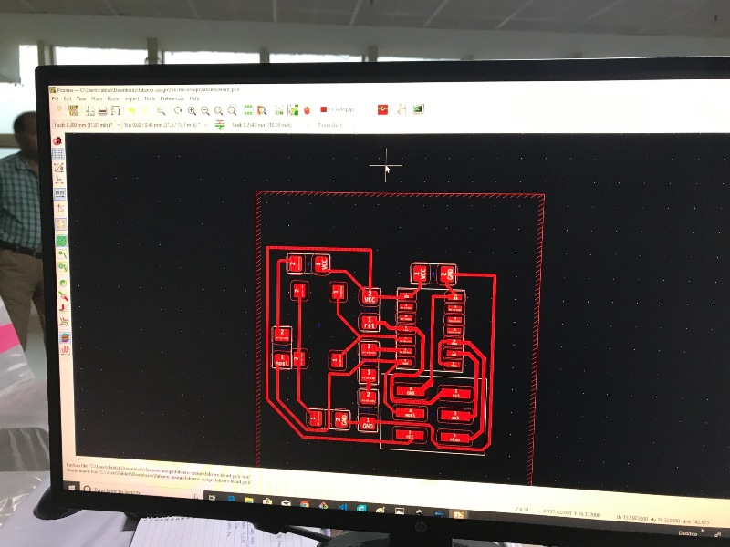
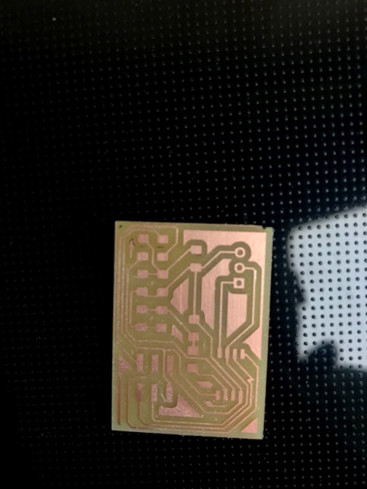
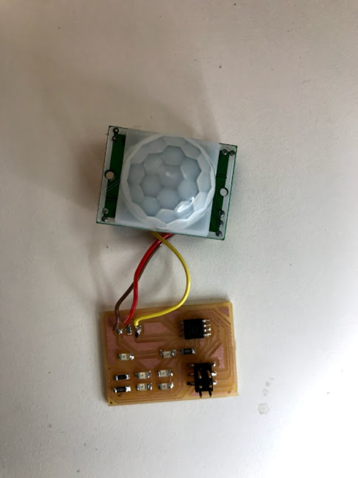

# Electronics (PCB Circuit Design and Layout)
Download Kicad and install it to the laptop.
# Introduction to KiCad

KiCad is an open-source software tool for the creation of electronic schematic diagrams and PCB artwork. Beneath its singular surface, KiCad incorporates an elegant ensemble of the following stand-alone software tools:
# KiCad Workflow

Despite its similarities with other PCB design software, KiCad is characterised by a unique workflow in which schematic components and footprints are separate. Only after creating a schematic are footprints assigned to the components.
# Overview

The KiCad workflow is comprised of two main tasks: drawing the schematic and laying out the board. Both a schematic component library and a PCB footprint library are necessary for these two tasks. KiCad includes many components and footprints, and also has the tools to create new ones.

In the picture below, you see a flowchart representing the KiCad workflow. The flowchart explains which steps you need to take, and in which order. When applicable, the icon is added for convenience.
# Draw electronic schematics

In this section we are going to learn how to draw an electronic schematic using KiCad.
Using Eeschema:-

    Under Windows run kicad.exe. Under Linux type 'kicad' in your Terminal. You are now in the main window of the KiCad project manager. From here you have access to eight stand-alone software tools: Eeschema, Schematic Library Editor, Pcbnew, PCB Footprint Editor, GerbView, Bitmap2Component, PCB Calculator and Pl Editor. Refer to the work-flow chart to give you an idea how the main tools are used.

Create a new project: File → New → Project. Name the project file 'tutorial1'. The project file will automatically take the extension ".pro". The exact appearance of the dialog depends on the used platform, but there should be a checkbox for creating a new directory. Let it stay checked unless you already have a dedicated directory. All your project files will be saved there.

Let’s begin by creating a schematic. Start the schematic editor Eeschema, Eeschema. It is the first button from the left.

Click on the 'Page Settings' icon Sheet settings icon on the top toolbar. Set the appropriate 'paper size' ('A4','8.5x11' etc.) and enter the Title as 'Tutorial1'. You will see that more information can be entered here if necessary. Click OK. This information will populate the schematic sheet at the bottom right corner. Use the mouse wheel to zoom in. Save the whole schematic: File → Save

We will now place our first component. Click on the 'Place symbol' icon Add component Icon in the right toolbar. You may also press the 'Add Symbol' hotkey [a].

Click on the middle of your schematic sheet. A Choose Symbol window will appear on the screen. We’re going to place a resistor. Search / filter on the 'R' of Resistor. You may notice the 'Device' heading above the Resistor. This 'Device' heading is the name of the library where the component is located, which is quite a generic and useful library.

Double click on it. This will close the 'Choose Symbol' window. Place the component in the schematic sheet by clicking where you want it to be.

Click on the magnifier icon to zoom in on the component. Alternatively, use the mouse wheel to zoom in and zoom out. Press the wheel (central) mouse button to pan horizontally and vertically.

Try to hover the mouse over the component 'R' and press [r]. The component should rotate. You do not need to actually click on the component to rotate it.
Right click in the middle of the component and select Properties → Edit Value. You can achieve the same result by hovering over the component and pressing [v]. Alternatively, [e] will take you to the more general Properties window. Notice how the right-click menu below shows the hotkeys for all available actions.

The Edit Value Field window will appear. Replace the current value 'R' with '1 k'. Click OK.

Resistor Value

To place another resistor, simply click where you want the resistor to appear. The symbol selection window will appear again.

The resistor you previously chose is now in your history list, appearing as 'R'. Click OK and place the component.

In case you make a mistake and want to delete a component, right click on the component and click 'Delete'. This will remove the component from the schematic. Alternatively, you can hover over the component you want to delete and press [Delete].

You can also duplicate a component already on your schematic sheet by hovering over it and pressing [c]. Click where you want to place the new duplicated component.

Right click on the second resistor. Select 'Drag'. Reposition the component and left click to drop. The same functionality can be achieved by hovering over the component and by pressing [g]. [r] will rotate the component while [x] and [y] will flip it about its x- or y-axis.

Edit the second resistor by hovering over it and pressing [v]. Replace 'R' with '100'. You can undo any of your editing actions with Ctrl+Z.

Change the grid size. You have probably noticed that on the schematic sheet all components are snapped onto a large pitch grid. You can easily change the size of the grid by Right-Click → Grid. In general, it is recommended to use a grid of 50.0 mils for the schematic sheet.

We are going to add a component from a library that may not be configured in the default project. In the menu, choose Preferences → Manage Symbol Libraries. In the Symbol Libraries window you can see two tabs: Global Libraries and Project Specific Libraries. Each one has one sym-lib-table file. For a library (.lib file) to be available it must be in one of those sym-lib-table files. If you have a library file in your file system and it’s not yet available, you can add it to either one of the sym-lib-table files. For practice we will now add a library which already is available.

Select the Project Specific table. Click the file browser button below the table. You need to find where the official KiCad libraries are installed on your computer. Look for a library directory containing a hundred of .dcm and .lib files. Try in C:\Program Files (x86)\KiCad\share\ (Windows) and /usr/share/kicad/library/ (Linux). When you have found the directory, choose and add the 'MCU_Microchip_PIC12.lib' library and close the window. It will be added to the end of of the list. Now click its nickname and change it to 'microchip_pic12mcu'. Close the Symbol Libraries window with OK.

Repeat the add-component steps, however this time select the 'microchip_pic12mcu' library instead of the 'Device' library and pick the 'PIC12C508A-ISN' component.

Hover the mouse over the microcontroller component. Notice that [x] and [y] again flip the component. Keep the symbol mirrored around the Y axis so that the pins G0 and G1 point to right.

Repeat the add-component steps, this time choosing the 'Device' library and picking the 'LED' component from it.

Organise all components on your schematic sheet as shown below.

It is time to place the power and ground symbols. Click on the 'Place power port' button add_power_png on the right toolbar. Alternatively, press [p]. In the component selection window, scroll down and select 'VCC' from the 'power' library. Click OK.
Repeat the add-pin steps but this time select the GND part. Place a GND part under the GND pin of 'ATTINY44'. Place another GND symbol on the left of the VSS pin of the microcontroller. 
Next, we will wire all our components. Click on the 'Place wire' icon Place wire on the right toolbar.
Repeat this process and wire up all the other components as shown below. To terminate a wire just double-click. When wiring up the VCC and GND symbols, the wire should touch the bottom of the VCC symbol and the middle top of the GND symbol.
We will now check our schematic for errors. Click on the 'Perform electrical rules check' icon erc_png on the top toolbar. Click on the 'Run' button. A report informing you of any errors or warnings such as disconnected wires is generated. You should have 0 Errors and 0 Warnings. In case of errors or warnings, a small green arrow will appear on the schematic in the position where the error or the warning is located. Check 'Create ERC file report' and press the 'Run' button again to receive more information about the errors.
The schematic is now finished. We can now create a Netlist file to which we will add the footprint of each component. Click on the 'Generate netlist' icon netlist_png on the top toolbar. Click on the 'Generate Netlist' button and save under the default file name.
After generating the Netlist file, click on the 'Run Cvpcb' icon cvpcb_png on the top toolbar. If a missing file error window pops up, just ignore it and click OK.

Cvpcb allows you to link all the components in your schematic with footprints in the KiCad library. The pane on the center shows all the components used in your schematic. Here select 'D1'. In the pane on the right you have all the available footprints, here scroll down to 'LED_THT:LED-D5.0mm' and double click on it.

It is possible that the pane on the right shows only a selected subgroup of available footprints. This is because KiCad is trying to suggest to you a subset of suitable footprints. Click on the icons module_filtered_list_png, module_pin_filtered_list_png and module_library_list_png to enable or disable these filters.

For 'U1' select the 'Package_DIP:DIP-8_W7.62mm' footprint. For 'J1' select the 'Connector:Banana_Jack_3Pin' footprint. For 'R1' and 'R2' select the 'Resistor_THT:R_Axial_DIN0207_L6.3mm_D2.5mm_P2.54mm_Vertical' footprint.

If you are interested in knowing what the footprint you are choosing looks like, you can click on the 'View selected footprint' icon show_footprint_png for a preview of the current footprint.

You are done. You can save the schematic now by clicking File → Save Schematic or with the button 'Apply, Save Schematic & Continue'.

You can close Cvpcb and go back to the Eeschema schematic editor. If you didn’t save it in Cvpcb save it now by clicking on File → Save. Create the netlist again. Your netlist file has now been updated with all the footprints. Note that if you are missing the footprint of any device, you will need to make your own footprints. This will be explained in a later section of this document.

Switch to the KiCad project manager. You can see the net list file in the file list.

The netlist file describes all components and their respective pin connections. The netlist file is actually a text file that you can easily inspect, edit or script.
To create a Bill Of Materials (BOM), go to the Eeschema schematic editor and click on the 'Generate bill of materials' icon bom_png on the top toolbar. By default there is no plugin active. You add one, by clicking on Add Plugin button. Select the *.xsl file you want to use, in this case, we select bom2csv.xsl.
Now press 'Generate'. The file (same name as your project) is located in your project folder. Open the *.csv file with LibreOffice Calc or Excel. An import window will appear, press OK.
# Layout printed circuit boards
Using Pcbnew

    From the KiCad project manager, click on the 'Pcb layout editor' icon pcbnew_png. You can also use the corresponding toolbar button from Eeschema. The 'Pcbnew' window will open. If you get a message saying that a *.kicad_pcb file does not exist and asks if you want to create it, just click Yes.

    Begin by entering some schematic information. Click on the 'Page settings' icon sheetset_png on the top toolbar. Set the appropriate 'paper size' ('A4','8.5x11' etc.) and 'title' as 'Tutorial1'.

    It is a good idea to start by setting the clearance and the minimum track width to those required by your PCB manufacturer. In general you can set the clearance to '0.25' and the minimum track width to '0.25'. Click on the Setup → Design Rules menu. If it does not show already, click on the 'Net Classes Editor' tab. Change the 'Clearance' field at the top of the window to '0.25' and the 'Track Width' field to '0.25' . Measurements here are in mm.
    

Click on the 'Global Design Rules' tab and set 'Minimum track width' to '0.25'. Click the OK button to commit your changes and close the Design Rules Editor window.

Now we will import the netlist file if you created one. Click on the 'Read netlist' icon netlist_png on the top toolbar. The netlist file 'tutorial1.net' should be selected in the 'Netlist file' field if it was created from Eeschema. Click on 'Read Current Netlist'. Then click the 'Close' button.

All components should now be visible. They are selected and follow the mouse cursor.

Move the components to the middle of the board. If necessary you can zoom in and out while you move the components. Click the left mouse button.

All components are connected via a thin group of wires called ratsnest. Make sure that the 'Show/hide board ratsnest' button general_ratsnest_png is pressed. In this way you can see the ratsnest linking all components.

You can move each component by hovering over it and pressing [m]. Click where you want to place them. Alternatively you can select a component by clicking on it and then drag it. Press [r] to rotate a component. Move all components around until you minimise the number of wire crossovers.

Note how one pin of the 100 ohm resistor is connected to pin 6 of the PIC component. This is the result of the labelling method used to connect pins. Labels are often preferred to actual wires because they make the schematic much less messy.

Now we will define the edge of the PCB. Select the 'Edge.Cuts' layer from the drop-down menu in the top toolbar. Click on the 'Add graphic lines' icon add_dashed_line_png on the right toolbar. Trace around the edge of the board, clicking at each corner, and remember to leave a small gap between the edge of the green and the edge of the PCB.

Next, connect up all the wires except GND. In fact, we will connect all GND connections in one go using a ground plane placed on the bottom copper (called B.Cu) of the board.

Now we must choose which copper layer we want to work on. Select 'F.Cu (PgUp)' in the drop-down menu on the top toolbar. This is the front top copper layer.

If you decide, for instance, to do a 4 layer PCB instead, go to Setup → Layers Setup and change 'Copper Layers' to 4. In the 'Layers' table you can name layers and decide what they can be used for. Notice that there are very useful presets that can be selected via the 'Preset Layer Groupings' menu.

Click on the 'Route tracks' icon add_tracks_png on the right toolbar. Click on pin 1 of 'J1' and run a track to pad 'R2'. Double-click to set the point where the track will end. The width of this track will be the default 0.250 mm. You can change the track width from the drop-down menu in the top toolbar. Mind that by default you have only one track width available.
If you would like to add more track widths go to: Setup → Design Rules → Global Design Rules tab and at the bottom right of this window add any other width you would like to have available. You can then choose the widths of the track from the drop-down menu while you lay out your board.

Alternatively, you can add a Net Class in which you specify a set of options. Go to Setup → Design Rules → Net Classes Editor and add a new class called 'power'. Change the track width from 8 mil (indicated as 0.0080) to 24 mil (indicated as 0.0240). Next, add everything but ground to the 'power' class (select 'default' at left and 'power' at right and use the arrows).

If you want to change the grid size, Right click → Grid. Be sure to select the appropriate grid size before or after laying down the components and connecting them together with tracks.

Repeat this process until all wires.

Let’s now run a track on the other copper side of the PCB. Select 'B.Cu' in the drop-down menu on the top toolbar. Click on the 'Route tracks' icon add_tracks_png. Draw a track between pin 3 of J1 and pin 8 of U1. This is actually not necessary since we could do this with the ground plane. Notice how the colour of the track has changed.

Go from pin A to pin B by changing layer. It is possible to change the copper plane while you are running a track by placing a via. While you are running a track on the upper copper plane, right click and select 'Place Via' or simply press [v]. This will take you to the bottom layer where you can complete your track.

When you want to inspect a particular connection you can click on the 'Highlight net' icon net_highlight_png on the right toolbar. Click on pin 3 of J1. The track itself and all pads connected to it should become highlighted.

Now we will make a ground plane that will be connected to all GND pins. Click on the 'Add filled zones' icon add_zone_png on the right toolbar. We are going to trace a rectangle around the board, so click where you want one of the corners to be. In the dialogue that appears, set 'Default pad connection' to 'Thermal relief' and 'Outline slope' to 'H,V and 45 deg only' and click OK.

Trace around the outline of the board by clicking each corner in rotation. Finish your rectangle by clicking the first corner second time. Right click inside the area you have just traced. Click on 'Zones'→'Fill or Refill All Zones'.
Run the design rules checker by clicking on the 'Perform design rules check' icon drc_png on the top toolbar. Click on 'Start DRC'. There should be no errors. Click on 'List Unconnected'. There should be no unconnected items. Click OK to close the DRC Control dialogue.

Save your file by clicking on File → Save. To admire your board in 3D, click on View → 3D Viewer.

You can drag your mouse around to rotate the PCB.

Your board is complete. To send it off to a manufacturer you will need to generate all Gerber files.

# Generate Gerber files

Once your PCB is complete, you can generate Gerber files for each layer and send them to your favourite PCB manufacturer, who will make the board for you.

    From KiCad, open the Pcbnew board editor.

    Click on File → Plot. Select 'Gerber' as the 'Plot format' and select the folder in which to put all Gerber files. Proceed by clicking on the 'Plot' button.

    To generate the drill file, from Pcbnew go again to the File → Plot option. Default settings should be fine.

    These are the layers you need to select for making a typical 2-layer PCB:

