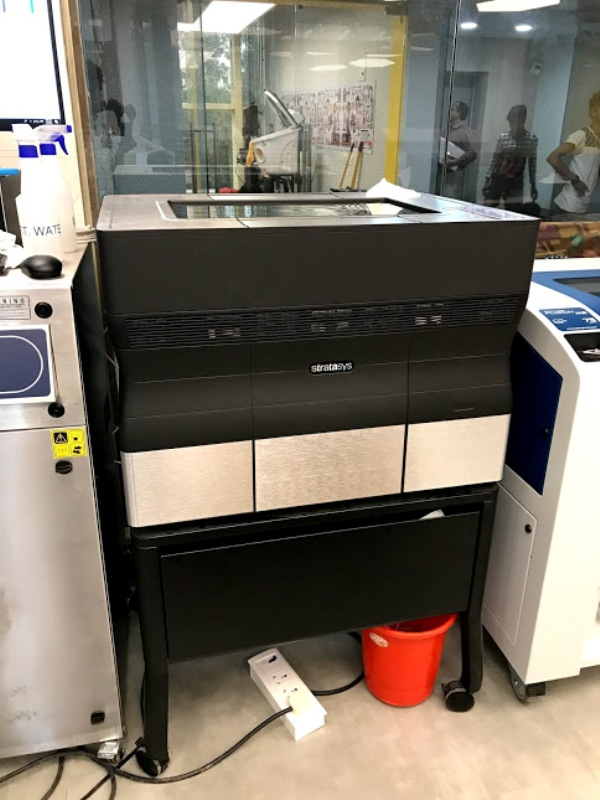
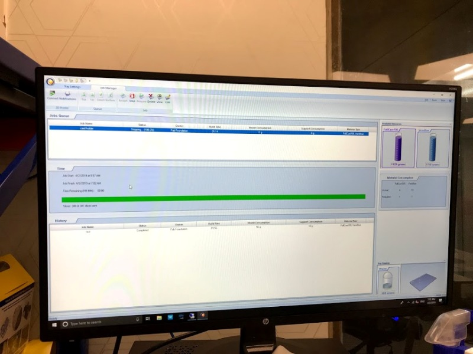
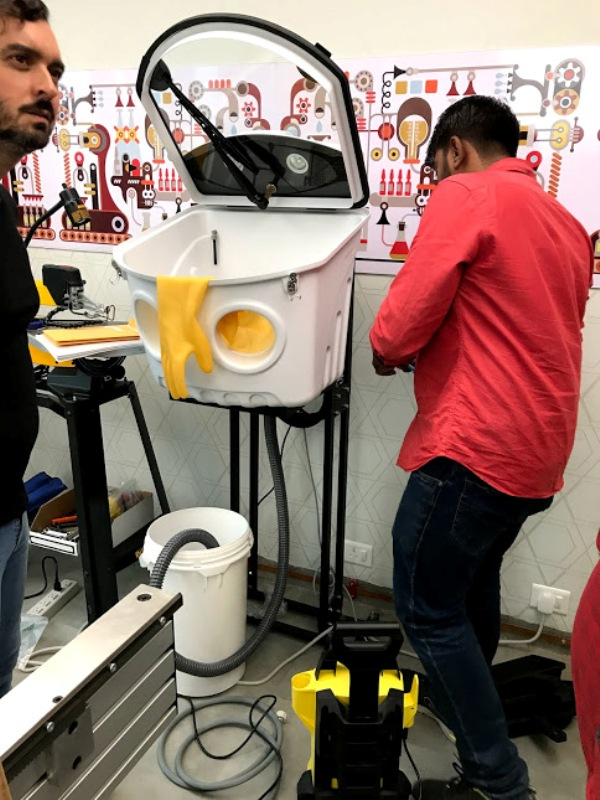
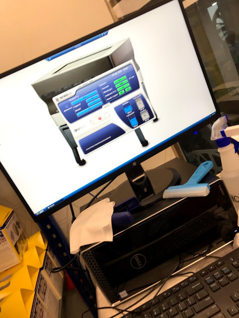
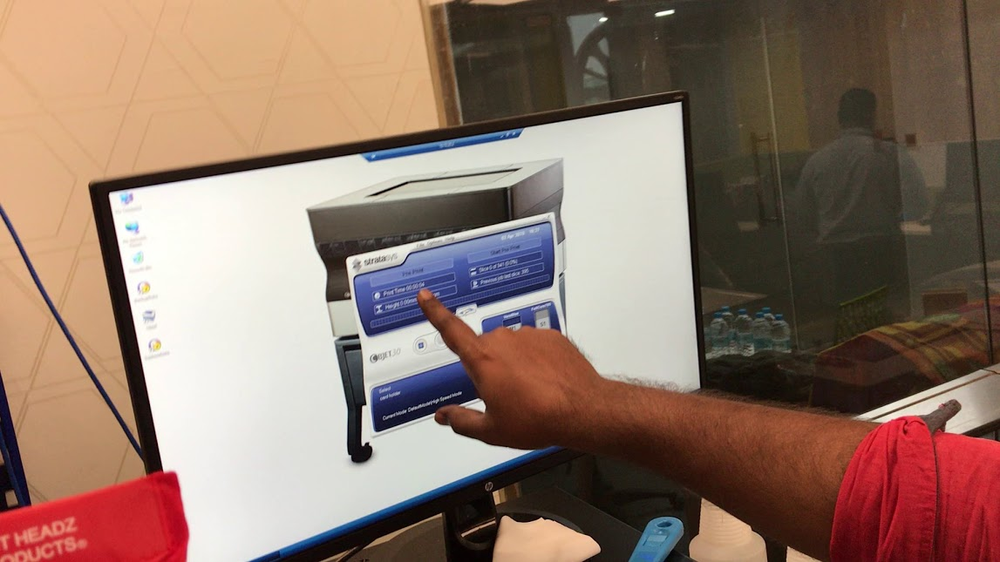

# STRATASYS 3D Printer
# Stratasys Polyjet 3d Printer at our Fab Lab:-

# Working of PolyJet 3D Printers

At the core of PolyJet printers are the jetting heads. The jetting heads deposit a single layer of the build material (typically photopolymers) by sliding to and fro along the X axis. The depth of each layer of photopolymer deposited by each jetting head is selectively controlled by software. Raster scanning the head across the build platform delivers the capability to produce precise models. There are many ways in which PolyJet printers work, but one of the most popular techniques is spraying a liquid photopolymer from a multi-nozzle, inkjet-style print head. As soon as the droplets of these liquid photopolymers are jetted, they are immediately cured and hardened by an UV light. Once a layer is complete, the build platform drops along the Z axis, and the next layer of photopolymers is ejected from the heads. The process is repeated till the object is complete.

The raw material is stored in cartridges and is directly connected to the nozzles.

# There are four important advantages of PolyJet 3D printers:

i. There can be a number of jetting heads that allow different build materials to be ejected at the same time. This makes it possible for 3D PolyJet printers to produce an object with different levels of flexibility in a single build. PolyJet 3D printers hence are useful to build complex objects with a smooth finish.

ii. As 3D PolyJet printers have multiple jetting heads, they allow for using photopolymers with different colours in a single build. You can therefore build multi-coloured objects easily.

iii. Since the build platform is typically lowered after an iteration of layer, there is more control over accuracy. High quality 3D PolyJet printers have an accuracy of 16 microns (0.016 mm). This allows for excellent detailing. Once a model is complete, it is perfectly structured and does not require additional curing or processing. If a support material is used, it is easily removable. In most cases, it can be simply washed off with water.

iv. There is a wide choice of raw material that is available for printing. At present, there are more than 100+ types of build material available for 3D PolyJet printers, and their number is increasing.

# PolyJet 3D Printers

In addition to creating liquid pools of photopolymer resins cured from the top or bottom of the pool by using external light sources, there are different techniques that can be used for PolyJet printing. Objet now Stratasys, for example, uses inkjet applicators to apply the resins. A low level UV light then immediately cures the sprayed layer into a solid state. This technique allows PolyJet printers to mix a flexible material and a rigid one to create models with variable strength and flexibility. You can hence use PolyJet printers to print complex objects such as a prosthetic. A prosthetic is a flexible joint sandwiched between rigid, hard-plastic body components, and it can be printed in one go using PolyJet technology. You can even mix and match’ a variety of build material – part rigid and part opaque as an example - to create exact replica of real life objects that use such material. Educational aids, toys for kids, body and dental parts are only a few examples where the versatility of PolyJet printers can be utilized.

# Filament Material

The range of raw materials available today for 3D PolyJet printers is simply amazing. Apart from the standard photopolymers, the build material now includes clear, rubberlike and biocompatible photopolymers, and tough high-performance thermoplastics.

3D PolyJet printers use liquid plastic resins (a kind of polymers) that harden when exposed to a light source like UV light, lamps, projectors, etc.When the object in created in the stratasys 3d printer it is need to be cleaned .For this first we have to wear gloves and it is to be cleaned with the high pressure water jet cleaner for removing the extra wax from the printed 3d object