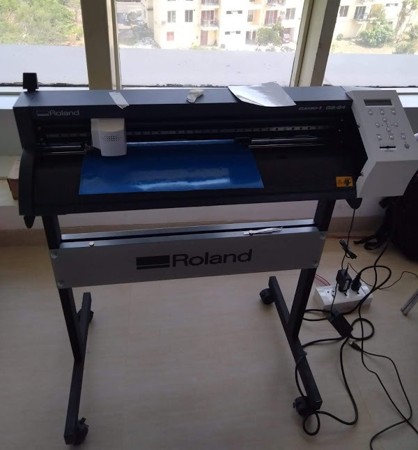

# Vinyl Cutter

Installed inkscape and Cura software in our laptop as instructed.
Designed our name through inkscape software.
Name size 150mmX50mm.
Exported the design to .png file to any location of our laptop.
Convert the the .png image file to .camm file through fabmodules.org website.
in fabmodules.org website, the input file should be .png file - Output to Vinyl Roland Vinyl (.camm) and process to - cut vinyl.
Set Force-80, Velocity-20 and convert it by setting the Origin.
Then send command: -lpr -p gs24 -l test.camm
Before sending the command to print the design in Vinyl Cutter make sure to set the origin the of the niddle.
Take the Print out of the design and Paste Trans fat sticker on it.
Then remove the trans fat sticker by paste the design where ever you want.
